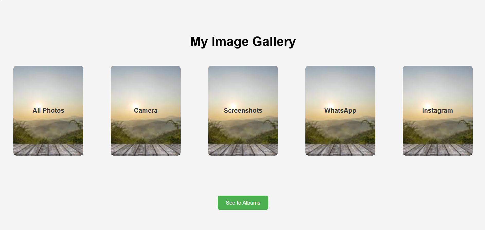

# CodeAlpha_Task1

Image Gallery

Overview

This project is a simple Image Gallery where users can view a collection of images. The gallery is built using HTML, CSS, and JavaScript, ensuring a responsive layout and smooth navigation. Users can browse through images with interactive features like next/previous buttons and lightbox effects.

Features

Responsive image grid layout

Click to enlarge images (lightbox effect)

Next and Previous navigation for images

Smooth animations and transitions

Mobile-friendly design

Technologies Used

HTML: Structure of the gallery

CSS: Styling and layout

JavaScript: Interactive functionalities (image navigation, lightbox, etc.)

## Screenshot

